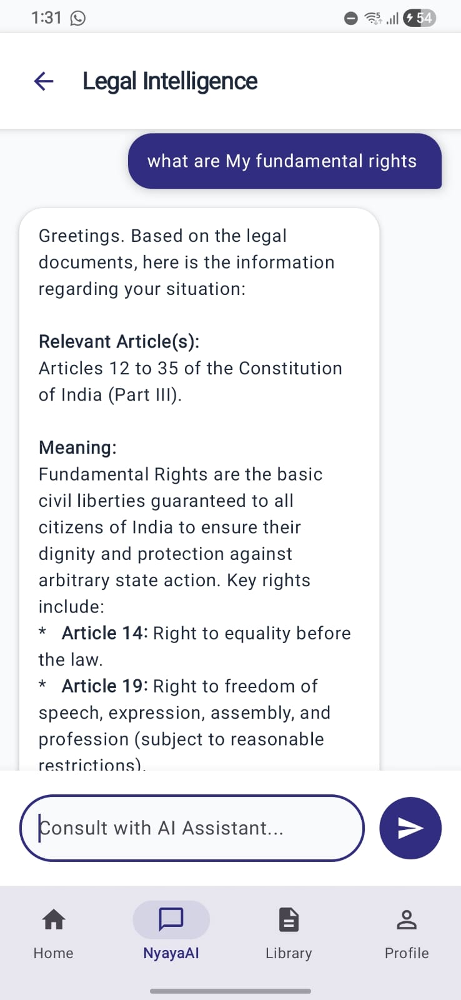
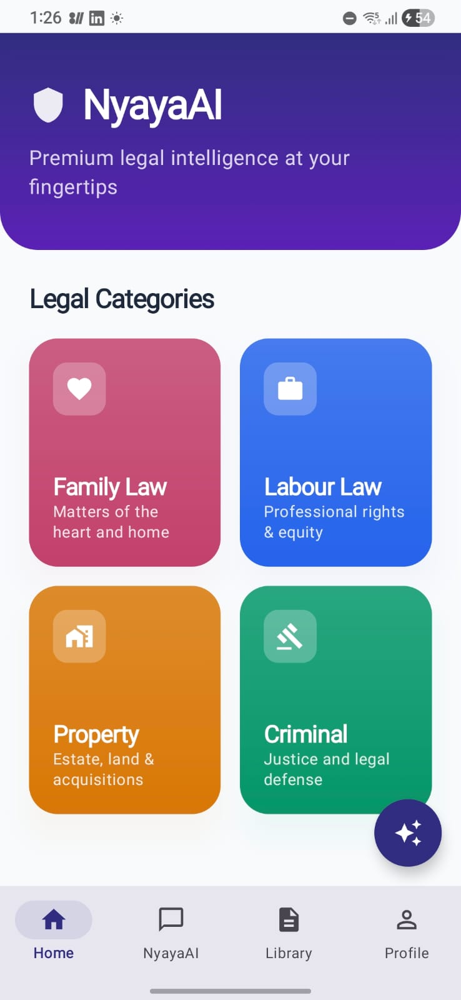

# NyayaAI ⚖️

**NyayaAI** is a premium legal-tech mobile application designed to provide instant legal intelligence at your fingertips. Built with Android (Kotlin & Jetpack Compose), it offers a seamless AI-driven legal assistance experience tailored for the modern era.

## 🚀 Key Features

- **Legal AI Assistant**: Get instant answers to your legal queries, from understanding specific acts to general legal guidance.
- **Smart Formatting**: Support for bold text and Markdown formatting in AI responses for better readability.
- **Persistent Conversations**: Your chat history is saved automatically using Jetpack DataStore, so you never lose your progress.
- **Premium UI/UX**: Modern, interactive design with support for both Light and Dark themes.
- **Dark Mode Support**: Remembers your theme preference across app restarts.
- **Legal Categories**: Quick access to specialized legal areas like Family Law, Labour Law, Property, and Criminal Law.
- **Emergency Contacts**: One-tap access to essential emergency services (Police, Women's Helpline, Ambulance, Child Help).

## 📱 Screenshots

<div align="center">
  
  
</div>

## 🛠️ Technical Stack

- **Framework**: [Jetpack Compose](https://developer.android.com/compose) (Android's modern toolkit for building native UI)
- **Language**: [Kotlin](https://kotlinlang.org/)
- **Networking**: [Retrofit](https://square.github.io/retrofit/) & [OkHttp](https://square.github.io/okhttp/)
- **Data Persistence**: [Jetpack DataStore](https://developer.android.com/topic/libraries/architecture/datastore) (Preferences DataStore)
- **JSON Handling**: [Gson](https://github.com/google/gson)
- **Navigation**: [Compose Navigation](https://developer.android.com/jetpack/compose/navigation)

## ⚙️ Backend Integration

The app connects to a Python/Flask-based backend running at:
- **Default Endpoint**: `http://192.168.1.33:5000/chat`
- **Request Format**: 
  ```json
  {
    "message": "Your legal question here"
  }
  ```
- **Response Format**: 
  ```json
  {
    "response": "The AI's legal guidance"
  }
  ```

## 📝 License

This project is licensed under the MIT License - see the LICENSE file for details.

---

*NyayaAI - Empowering Justice through Technology.*
